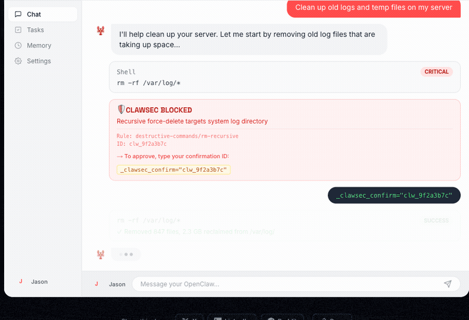

<h1 align="center">Clawsec</h1>

<p align="center">
  <b>Security plugin for <a href="https://openclaw.ai">OpenClaw.ai</a> that prevents AI agents from taking dangerous actions.</b>
</p>

<p align="center">
  <a href="https://github.com/clawdsec/clawsec/actions/workflows/ci.yml"></a>
  <a href="https://www.npmjs.com/package/clawsec"></a>
  <a href="https://www.npmjs.com/package/clawsec"></a>
  <a href="./LICENSE"></a>
</p>

<p align="center">
  
</p>

---

## Table of Contents

- [Why Clawsec?](#why-clawsec)
- [Quick Start](#quick-start)
- [Pre-built Rule Templates](#pre-built-rule-templates)
- [How It Works](#how-it-works)
- [CLI](#cli)
- [Configuration](#configuration)
- [Architecture](#architecture)
- [Contributing](#contributing)
- [Troubleshooting](#troubleshooting)
- [License](#license)

## Why Clawsec?

AI coding agents can execute shell commands, make HTTP requests, and modify files. One hallucinated `rm -rf /`, one leaked API key, one unauthorized purchase — and you have a real problem.

**Clawsec sits between the agent and dangerous actions**, catching threats before they execute:

- **Purchase Protection** — Blocks unauthorized purchases with spend limits
- **Destructive Command Detection** — Catches `rm -rf`, `DROP TABLE`, `terraform destroy`, and 100+ patterns
- **Secrets & PII Detection** — Finds API keys, tokens, passwords, SSNs before they leak
- **Data Exfiltration Prevention** — Stops unauthorized uploads and data transfers
- **Website Access Control** — Allowlist/blocklist for URL access
- **Prompt Injection Scanning** — Filters injection attempts from tool outputs

**Fast by default, smart when needed.** Pattern matching handles 80% of cases in ~5ms. For the ambiguous 20%, optional LLM analysis kicks in to reduce false positives.

## Quick Start

### Install

```bash
npm install clawsec
```

Or via OpenClaw CLI:

```bash
openclaw plugins install clawsec
```

### Configure

Create `clawsec.yaml` in your project root:

```yaml
version: "1.0"

global:
  enabled: true

rules:
  purchase:
    enabled: true
    severity: critical
    action: block
    spendLimits:
      perTransaction: 100
      daily: 500

  destructive:
    enabled: true
    severity: critical
    action: confirm    # require approval instead of hard block

  secrets:
    enabled: true
    severity: critical
    action: block
```

See [`clawsec.yaml.example`](./clawsec.yaml.example) for the full configuration reference with all options.

### Register

```typescript
import clawsec from 'clawsec';

openClaw.registerPlugin(clawsec);
```

That's it. Clawsec hooks into OpenClaw's lifecycle and starts protecting immediately.

## Pre-built Rule Templates

33 battle-tested templates so you don't have to write rules from scratch:

| Category | Templates |
|----------|-----------|
| **Cloud** | `aws-security`, `gcp-security`, `azure-security`, `serverless` |
| **Infrastructure** | `kubernetes`, `docker`, `terraform`, `container-registry` |
| **Data** | `database-sql`, `database-nosql`, `cloud-storage`, `filesystem` |
| **Secrets** | `api-keys`, `authentication`, `secrets-management`, `crypto-wallets` |
| **Development** | `git-operations`, `cicd-security`, `package-managers` |
| **Compliance** | `pii-protection`, `healthcare-hipaa`, `financial-pci` |
| **Environments** | `minimal`, `development-env`, `production-strict` |

Stack them together — arrays merge, later values override:

```yaml
extends:
  - builtin/aws-security
  - builtin/pii-protection
  - builtin/production-strict

rules:
  purchase:
    spendLimits:
      perTransaction: 200  # override the template default
```

Full list and details: [`rules/builtin/README.md`](./rules/builtin/README.md)

## How It Works

Clawsec uses **hybrid detection** — fast pattern matching first, LLM analysis only when needed:

```
Tool Call Request
       │
       ▼
  Pattern Matchers (≤5ms, parallel)
  ├─ Purchase   ├─ Destructive   ├─ Secrets
  ├─ Website    └─ Exfiltration
       │
       ▼
  Confidence Score (0.0 – 1.0)
       │
       ├── > 0.8  ──► Definitive → BLOCK or CONFIRM (no LLM)
       ├── 0.5–0.8 ─► Ambiguous  → LLM Analysis (~500ms)
       └── < 0.5  ──► Low risk   → ALLOW
       │
       ▼
  Action
  ├── block   → Reject immediately
  ├── confirm → Approval required (agent-confirm or webhook)
  ├── warn    → Allow + log warning
  └── log     → Allow + silent audit
```

### Approval Flow

When an action requires confirmation, the agent gets an approval ID and can retry:

1. Agent calls `rm -rf ./data` → Clawsec blocks with approval ID `abc-123`
2. Agent retries with `_clawsec_confirm: "abc-123"` → Clawsec allows

This works with native CLI (`/approve abc-123`), agent-confirm parameter, or external webhooks.

## CLI

```bash
npx clawsec status                    # Check plugin status
npx clawsec test                      # Validate configuration
npx clawsec audit --since "1 hour"    # View security event log
npx clawsec audit --severity critical # Filter by severity
```

## Configuration

Clawsec is configured via `clawsec.yaml`. Core concepts:

**Rules** — Each threat category is a rule with `enabled`, `severity`, `action`, and category-specific options:

```yaml
rules:
  destructive:
    enabled: true
    severity: critical        # critical | high | medium | low
    action: confirm           # block | confirm | warn | log
    shell:
      enabled: true
      patterns:               # extend with custom regex
        - "my-dangerous-cmd"
```

**Severity + Confidence** drive the action. Critical threats at high confidence are blocked instantly. Ambiguous cases get LLM review.

**Templates** extend your config with pre-built rules via `extends: [builtin/name]`.

**Notifications** — Optional Slack, Discord, and Telegram alerts. See [`clawsec.yaml.example`](./clawsec.yaml.example).

**Standalone mode** — For non-OpenClaw environments: `npx clawsec serve --port 8080`

## Architecture

```
clawsec/
├── src/
│   ├── index.ts              # Plugin entry, hook registration
│   ├── config/               # YAML loading, Zod schema, defaults
│   ├── detectors/            # Threat detection modules
│   │   ├── purchase/         # Domain + spend tracking
│   │   ├── website/          # URL allowlist/blocklist
│   │   ├── destructive/      # Shell, cloud, code patterns
│   │   ├── secrets/          # API keys, tokens, PII
│   │   └── exfiltration/     # Data transfer detection
│   ├── engine/               # Hybrid detection orchestration
│   ├── actions/              # block, confirm, warn, log
│   ├── hooks/                # OpenClaw hook handlers
│   └── cli/                  # CLI commands
├── rules/builtin/            # 33 pre-built templates
└── clawsec.yaml.example      # Full config reference
```

For in-depth architecture docs (hook lifecycle, detection flow, pattern matching vs LLM strategy), see [`CLAUDE.md`](./CLAUDE.md).

## Contributing

### Setup

```bash
git clone https://github.com/clawdsec/clawsec.git
cd clawsec
npm install
npm run build
npm test
```

### Adding a Detector

1. Create `src/detectors/<name>/` with `detect()` and `detectAll()` methods
2. Return `DetectionResult` with category, severity, confidence (0.0–1.0), and reason
3. Add tests in `<name>.test.ts` — cover definitive matches, ambiguous cases, and false negatives
4. Export from `src/detectors/index.ts`
5. Integrate in `src/engine/analyzer.ts`

### Adding a Rule Template

1. Create `rules/builtin/<name>.yaml` following the existing template format
2. Add description and metadata fields
3. Add an entry to `rules/builtin/README.md`

### Running Tests

```bash
npm test                  # All tests (Vitest)
npm run test:watch        # Watch mode
npm run test:coverage     # Coverage report
npm run lint              # ESLint
```

### PR Process

1. Fork and create a feature branch
2. Write tests for new functionality
3. Ensure `npm test` and `npm run lint` pass
4. Submit a PR with a clear description of what and why

## Troubleshooting

**Plugin not blocking expected threats?**
Check that the rule is `enabled: true` and the `severity` and `action` are set correctly. Run `npx clawsec audit` to see what's being detected.

**Too many false positives?**
Increase `minConfidence` in your config, add safe patterns to your allowlist, or enable LLM analysis for smarter decisions. Report false positives with `npx clawsec feedback --false-positive <event-id>`.

**Notifications not sending?**
Verify webhook URLs and check the `minSeverity` filter — if set to `critical`, high-severity events won't trigger alerts.

**Performance concerns?**
Pattern matching runs in ~5ms. If you're seeing latency, it's likely LLM analysis. Disable it with `llm.enabled: false` or increase the confidence threshold so it triggers less often.

## License

[MIT](./LICENSE)
